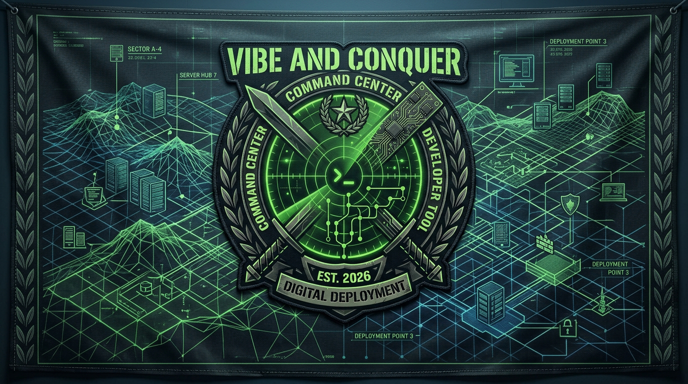

<a href="https://github.com/svengraziani/vibe-and-conquer/actions/workflows/ci.yml"></a>
<a href="https://github.com/svengraziani/vibe-and-conquer/actions/workflows/test.yml"></a>
<a href="https://discord.gg/qjxF5ZDS"></a>

# Vibe and Conquer

**Your self-hosted GitHub Command Center** — monitor every repo, visualize team activity on an RTS-style battlefield, and command Claude AI directly from the UI.


---

## Key Workflows

### Monitor at a Glance

Never lose track of what's happening across your repositories. The dashboard surfaces open PRs, issues, merge conflicts, review decisions, and running GitHub Actions — all in one place, updated in real time via SSE streaming.

- Conflict warnings surface prominently when merge conflicts are detected
- Draft PRs, stale branches, and AI-labeled tasks are all visible at a glance
- Configurable auto-refresh (30s – 30 min) keeps the view current

### Visualize the Battlefield

Each repository becomes a **base** on an infinite isometric RTS-style map. Pan, zoom, and reposition bases freely — your battlefield layout persists. The HUD shows live stats across the entire fleet: active bases, running conflicts, workflow runs, and stale branches.

- Minimap for quick navigation across large multi-repo setups
- Load custom terrain created in the built-in Map Editor
- Sound effects on scan complete and conflict detection

### Command with Claude (ClawCom)

Trigger Claude AI on any issue or PR with a single click, without leaving the dashboard. The **Construct Dialog** lets you post comments, assign labels, and kick off AI workflows directly from a repo's base node.

<!-- Add ClawCom gif here once recorded: docs/clawcom_demo.gif -->
> **ClawCom gif coming soon** — recording in progress.

- One-click `@claude` trigger on any issue or PR
- AI-labeled issues (`claude`, `ai`, `ai-fix`, `ai-feature`) surface in a dedicated section
- Claude-generated branches auto-link back to their source issues
- "Create a PR" links from Claude comments become one-click buttons in the UI

### Organize & Track

The **Intel Feed Panel** pulls your GitHub @mentions, open issues, and open PRs across all tracked repos into a single sidebar — so nothing falls through the cracks.

- Netlify deploy-preview URLs surface automatically in PR cards
- Voice input for hands-free issue and PR creation
- Repo metadata at a glance: stars, forks, languages, top contributors, and a 26-week commit activity sparkline

---

## Getting Started

### Prerequisites

- [Bun](https://bun.sh) installed
- [GitHub CLI](https://cli.github.com) installed and authenticated (`gh auth login`)

### Install & Run

```bash
cd gh-ctrl
bun install
cd client && bun install && cd ..
bun run dev
```

This starts both the backend (port `3001`) and the Vite dev server (port `5173`) concurrently.

### Production

```bash
cd gh-ctrl
bun run build   # builds the React client
bun run start   # serves everything on port 3001
```

---

## Docker

The easiest way to run Vibe and Conquer without installing Bun or the GitHub CLI locally.

**Prerequisites:** [Docker](https://docs.docker.com/get-docker/) with Compose v2 + a GitHub [personal access token](https://github.com/settings/tokens) with `repo` and `read:org` scopes.

```bash
cp .env.example .env
# Edit .env and set: GH_TOKEN=ghp_...
```

**Production** — builds the frontend into the image, serves everything on one port:

```bash
docker compose --profile prod up --build
# App at http://localhost:3001
```

**Development** — live reload with Vite HMR:

```bash
docker compose --profile dev up --build
# Frontend: http://localhost:5173  |  API: http://localhost:3001
```

The SQLite database is stored in a named Docker volume (`gh-ctrl-data`) and persists across restarts.

---

## GitHub Actions Workflows

Three Claude-powered workflows run automatically on your repositories:

| Workflow | Trigger | What it does |
|----------|---------|--------------|
| **`claude.yml`** | `@claude` mention in any issue or PR comment | Interactive AI assistant — answers questions, implements code, opens PRs |
| **`claude-code-review.yml`** | PR opened or synchronized | Automated code review with inline feedback |
| **`claude-conflict-resolver.yml`** | Merge conflict detected | Automatically resolves conflicts and pushes a fix |

These workflows are the backbone of **ClawCom** — the dashboard's AI command layer. Every triggered run is visible in the UI, linked back to the issue or PR that spawned it.

---

<details>
<summary><strong>Full Feature Reference</strong></summary>

### Dashboard
- Real-time SSE streaming — repos load as soon as they're ready
- Conflict warnings, draft PRs, running actions, stale branches
- Configurable auto-refresh (30s – 30 min)

### Battlefield View
- Infinite isometric canvas — pan, zoom, reposition bases freely
- HUD: active bases, conflicts, running processes, stale branches
- Minimap, sound effects, Relocate Mode (drag & drop bases)
- Intel Feed Panel: @mentions, open issues, open PRs across all repos

### Base Nodes (per-repo)
- Open PRs with review status, draft status, and Netlify preview URLs
- Open issues with labels and assignees
- Branch staleness visualization
- Repo metadata popup: stars, forks, watchers, languages, topics, top contributors, 26-week commit sparkline
- Construct Dialog: trigger Claude, post comments, add/remove labels, assign users, create PRs

### Map Editor
- Create isometric tile maps (up to 80×80 tiles) for battlefield backgrounds
- Tile color painting with multi-select and flood fill
- Save, load, delete named maps with mini-preview thumbnails

### Repository Management
- Browse and search owned, collaborator, and org repos — add with one click
- Manual `owner/repo` entry as fallback
- Customizable per-repo color (preset palette + custom hex picker)
- Create new GitHub repos directly from the dashboard

### Claude AI Integration
- Surfaces `claude`, `ai`, `ai-fix`, `ai-feature` labeled issues in a dedicated section
- Detects `claude/issue-*` branches and links them to source issues
- Parses Claude's "Create a PR" links into one-click buttons
- Shows active Claude workflow runs per repo

### Other
- Voice input for hands-free issue and PR creation
- Toast notifications for all actions

</details>

---

## Tech Stack

| Layer | Technology |
|-------|-----------|
| Runtime | [Bun](https://bun.sh) |
| Backend | [Hono](https://hono.dev) (port 3001) |
| Frontend | React 18 + Vite (port 5173 in dev) |
| Database | SQLite + [Drizzle ORM](https://orm.drizzle.team) |
| GitHub API | GitHub CLI (`gh`) |
| State Management | [Zustand](https://github.com/pmndrs/zustand) |

## Project Structure

```
vibe-and-conquer/
└── gh-ctrl/
    ├── src/
    │   ├── index.ts          # Hono server entry point
    │   ├── db/               # Drizzle ORM schema & SQLite connection
    │   └── routes/
    │       ├── github.ts     # GitHub data fetching via gh CLI (SSE streaming, actions, PRs, issues)
    │       ├── repos.ts      # Repository CRUD endpoints
    │       └── maps.ts       # Map CRUD endpoints (tile maps for Battlefield)
    └── client/
        └── src/
            ├── App.tsx               # Root app with view routing
            ├── store.ts              # Zustand global state
            ├── api.ts                # Frontend API client
            ├── types.ts              # Shared TypeScript types
            ├── hooks/                # Custom hooks (sound, voice input)
            └── components/
                ├── Dashboard.tsx     # Grid view of all repos
                ├── BattlefieldView.tsx # RTS-style isometric battlefield
                ├── BaseNode.tsx      # Per-repo node on the battlefield
                ├── MapEditor.tsx     # Tile map creation and editing
                ├── FeedPanel.tsx     # Intel feed (@mentions, issues, PRs)
                ├── ActionModal.tsx   # Claude trigger / issue action modal
                ├── ConstructDialog.tsx # Construct / issue action dialog
                ├── Settings.tsx      # Repo management and preferences
                └── RepoCard.tsx      # Repo card for the dashboard grid
```

---

## Star History

[](https://www.star-history.com/#svengraziani/vibe-and-conquer&type=date&legend=top-left)
